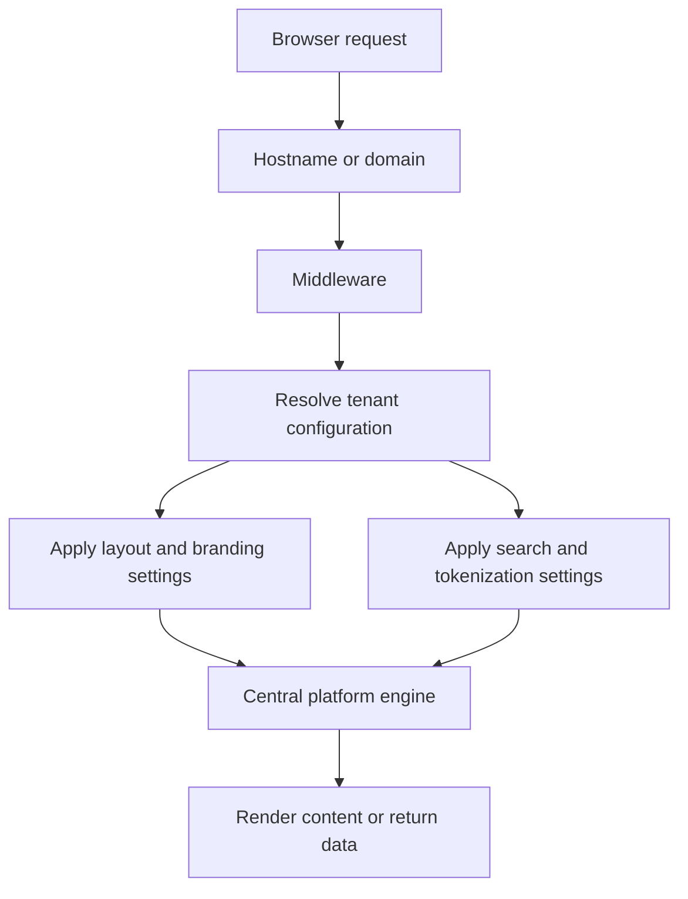
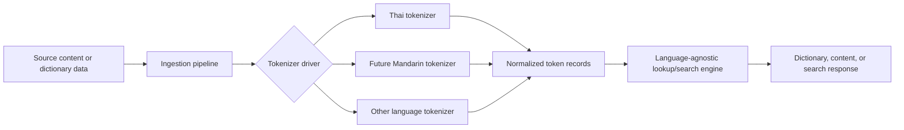
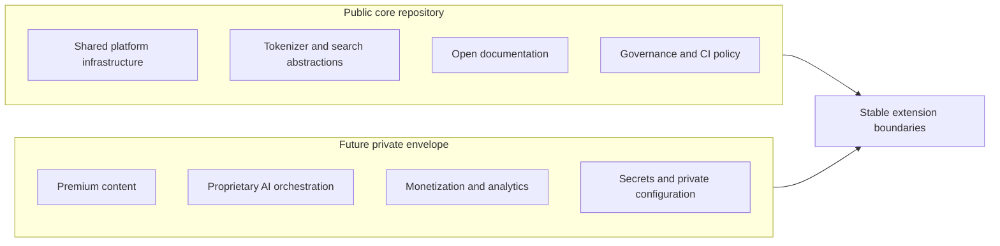

# Architecture Blueprint

`lingua-core-platform` is a governance-first modular monolith platform engine for Thai-English linguistic tooling, tokenizer/search infrastructure, SEO-first educational content, and future multilingual expansion.

This document defines the platform principles: system identity, core architectural constraints, directory layout, public/private boundary, and the deterministic query explainability model. Major architectural decisions are captured in `docs/adr/`. The phase-by-phase implementation roadmap is at `.claude/ROADMAP.md`.

## System Overview

The platform is intended to serve multiple language-learning and linguistic experiences from one shared core. A request enters through a tenant-aware routing layer, resolves the appropriate tenant configuration, applies tenant-specific presentation and language settings, and delegates to shared platform capabilities.

The central engine should own reusable infrastructure such as routing conventions, tokenizer interfaces, lookup/search abstractions, dictionary data access, tenant configuration boundaries, and shared validation logic.

## Core Architectural Principles

- Preserve a modular monolith as the default architecture.
- Keep tenant domains and language domains in one repository with clear internal module boundaries.
- Treat tokenization and linguistic parsing as pluggable infrastructure.
- Keep the public repository focused on shared platform infrastructure and open governance.
- Separate public/open data from premium, proprietary, or private data.
- Prefer static rendering, SEO durability, dictionary/search foundations, and browser-native fallbacks before interactive multi-user features.
- Avoid framework, hosting, database, or AI-provider lock-in in this blueprint.
- Record major architectural decisions in ADRs before making them binding.

## Directory Layout

Current high-level layout confirmed from working tree:

```text
.
├── src/
│   └── core/
│       ├── lexical/
│       │   ├── contracts.ts
│       │   ├── index.ts
│       │   ├── datasets/
│       │   │   └── thai-english/
│       │   ├── diagnostics/
│       │   ├── identity/
│       │   ├── index/
│       │   ├── lookup/
│       │   ├── normalization/
│       │   ├── provenance/
│       │   ├── reading/
│       │   ├── spelling/
│       │   ├── validation/
│       │   └── writing/
│       └── tokenizers/
│           ├── index.ts
│           ├── drivers/
│           │   ├── dictionary/
│           │   └── mock/
│           ├── normalization/
│           ├── pipeline/
│           └── search/
│               ├── index-primitives/
│               ├── matching/
│               ├── pipeline/
│               ├── query-engine/
│               ├── query-ir/
│               ├── query-learning-interop/
│               ├── query-lexical-interop/
│               ├── query-parser/
│               ├── query-pipeline/
│               ├── query-snapshots/
│               ├── query-tracing/
│               ├── runtime-capabilities/
│               ├── shared/
│               └── utils/
├── docs/
│   ├── adr/
│   ├── architecture/
│   └── validation/
├── ARCHITECTURE.md
├── DATA_SOURCES.md
├── AGENTS.md
└── README.md
```

Directory responsibilities:

- `src/core/lexical/`: lexical identity contracts, dataset access, diagnostics, normalization rules, index, lookup, dictionary data boundary contracts (`provenance/`), and dataset validation.
- `src/core/tokenizers/`: tokenizer driver interface and implementations (dictionary, mock), text normalization pipeline, tokenization pipeline, and the search subsystem — query parsing, query IR, query execution engine, query snapshots and replay governance, query tracing and explainability, runtime capability governance, and query-lexical interoperability.
- `docs/adr/`: architecture decision records documenting durable platform decisions.
- `docs/architecture/`: supplementary architecture reference documents covering ordering guarantees, replay governance lifecycle, and certification foundations.
- `docs/validation/`: validation checklists and manual testing scenarios for tokenizer and search behavior.

## Learning Surface Layer

The learning surface layer is the Phase 12 structural boundary positioned
between the dictionary data boundary (Phase 11) and the search-to-learning
integration layer (Phase 13).

It introduces two structural types representing learner-facing projections
of canonical dictionary entries. Both types embed `CanonicalDictionaryEntry`
directly and are classified as structural (no `evaluationTimestamp`, no
`generatedFrom`).

### Types

**`ReadingPrimitive`** — `src/core/lexical/reading/reading-primitive.ts`
Represents a reading exercise unit. Contains the target dictionary entry
and any licensed example usage content associated with it. Example sentence
fields require a grounded candidate dataset in `DATA_SOURCES.md` with
compatible licensing before they may be introduced.

**`WritingPrimitive`** — `src/core/lexical/writing/writing-primitive.ts`
Represents a writing exercise unit. Contains the target dictionary entry,
the reference character form for the exercise, and the exercise mode
(free fill or template overlay). Handwriting capture, stroke interpretation,
user input evaluation, and scoring are out of scope for this layer and are
deferred to a later phase.

### Layer Position

IngestionReadyDictionaryEntry (Phase 11 — dictionary data boundary)
↓
ReadingPrimitive (Phase 12 — learning surface)
WritingPrimitive (Phase 12 — learning surface)
↓
ReadingPrimitiveSearchProjection
WritingPrimitiveSearchProjection  
SpellingEntrySearchProjection
(Phase 13 — search-to-learning integration, query-learning-interop/)

## Tenant and Content Configuration Layer

The tenant and content configuration layer is the Phase 15 structural boundary,
positioned after the Phase 14 delivery boundary in the layer stack. This section
is binding architectural grounding for the tenant and content configuration
concepts named below; the binding per-phase boundary decision for this layer is
recorded in ADR-0014. It supplies binding grounding — not the conceptual sketch of
the Database Blueprint — for exactly the concepts defined here, and for nothing
else.

Configuration at this layer is structural data only. A configuration artifact is
deterministic, caller-supplied, and deep-frozen; equivalent inputs produce
equivalent configuration. This layer is not a tenant-resolution engine, a routing
layer, or a runtime configuration evaluator. The runtime flow described in
"Multi-Tenant Routing Concept" (hostname → middleware → resolve → apply) is a
separate, later concern and is not grounded by this layer.

### Tenant Identity

A tenant identity is a structural, caller-supplied identifier distinguishing one
tenant's configuration from another. It carries no generated value, no default,
and no internal derivation routine; it accepts a caller-supplied primitive only
(Replay-Safe Governance Law). It is read as data, never resolved at runtime from a
hostname, domain, or request context (Static Resolution Law); that resolution is
the runtime concern of the Multi-Tenant Routing Concept and is out of scope here.

### Tenant-Scoped Enabled-Language Configuration

Tenants may declare which already-supported language experiences are enabled for
that tenant. Adding new language modules remains Phase 17.

Enabled-language configuration is the deterministic, caller-supplied structural
representation of which of the platform's already-supported languages are enabled
for a given tenant. The platform's currently supported scope is Thai-first
(Thai-English). Enabling a language is a configuration choice over the existing
supported set; it is never the addition or expansion of a language module. A
configuration that would enable a language the platform does not already support
is out of scope and belongs to Phase 17 (Multilingual expansion).

Enabled-language values reference the platform's canonical language identity (see
the Canonical Language Identity section): the currently delivered set, represented
by standard language tags (`th`, `en`). The earlier precursor — whether to reuse an
existing language type or establish a canonical one — is resolved there.
Enabled-language configuration is typed against canonical language identity, not
against `SupportedLanguageCode` (which may carry not-yet-delivered codes) or
`LexicalLanguageCode`. The Phase 15/17 boundary holds: enabling a currently
delivered language is Phase 15; adding a language to the delivered set is Phase 17.

Enabled-language configuration is set-valued: each delivered language appears at
most once for a tenant. A configuration that presents the same delivered language
more than once is invalid and is rejected at construction; duplicate entries are
not silently de-duplicated, so caller input is never normalized. The stored
representation is deterministically ordered by the platform's binary lexicographic
ordering rule. An empty set is permitted and denotes a tenant with no currently
enabled language experience; no minimum-membership invariant is imposed.

### Grounding Scope and the Database Blueprint

This layer provides binding architectural grounding for two concepts only: tenant
identity and tenant-scoped enabled-language configuration, as defined above. A
Phase 15 contract field may be grounded in these definitions. The "Database
Blueprint" section remains conceptual ("subject to ADRs and future migration
decisions") in all other respects: this section promotes only these two concepts
from that conceptual sketch to binding grounding, and the remaining candidate
fields (hostname/domain mapping, branding references, feature flags, and the
dictionary_tenant_tags tagging/visibility/weighting concepts) stay conceptual and
are not grounding for any contract field. Content organization (curriculum, lesson
grouping, content sequencing, tenant-specific weighting, content visibility),
branding, feature boundaries, runtime tenant resolution, and the addition of new
language modules are not grounded here; grounding any of them later requires a
further binding amendment and remains an operator decision.

## Canonical Language Identity

Canonical language identity is the platform's binding representation of the human
languages it delivers. A delivered language is identified by its standard language
tag (BCP 47, which subsumes ISO 639); the currently delivered set is Thai (`th`)
and English (`en`). This identity is a closed enumeration of the languages the
platform actually delivers — not a registry of every language an internal layer
may reference.

This identity is structural and forward-only. It is introduced as binding
grounding for language-aware configuration from Phase 15 onward; it does not
migrate, rename, or alter any existing type.

Relationship to existing language types (no coupling). Canonical language identity
is distinct from, and independent of, the two pre-existing language types:

- `SupportedLanguageCode` (`"th" | "zh" | "en"`, tokenizer driver) is the
  tokenizer's own code set and may carry codes for languages not yet delivered by
  the platform (e.g. `zh`, a Phase 17 module). It is not the canonical
  delivered-language identity, and the two must not be coupled or
  auto-synchronized — an edit to one never implies an edit to the other.
- `LexicalLanguageCode` (`"thai" | "en"`, lexical entry identity) is the language
  segment of a lexical entry identifier and uses a different spelling for Thai
  (`thai`). It is a lexical-domain identity, not the canonical delivered-language
  identity.
  The spelling divergence between canonical language identity (`th`) and
  `LexicalLanguageCode` (`thai`) is tolerated legacy, not an error to be reconciled
  (ABSTRACTION GOVERNANCE LAW — intentional duplication over premature coupling; NO
  OPPORTUNISTIC CLEANUP LAW). No existing language type is migrated.

Expansion is governed. Adding a language to the delivered set — including any
dialect or regional variant — is a Phase 17 (Multilingual expansion) decision and
a governed, explicit edit to this identity. This section grounds only the
currently delivered set; it neither enumerates nor designs for any not-yet-
delivered language.

This resolves the canonical-language-identity precursor recorded in ADR-0014 §7
and in the Tenant and Content Configuration Layer. The concrete type name, shape,
guard form, and file placement are derived at per-slice pre-implementation
assessment under the DOCUMENTARY DERIVATION LAW and TYPED REFERENCE LAW; this
section does not prescribe them.

### Tenant and Content Configuration Non-Goals

The following are excluded from this layer, each barred by a named law or deferred
to a later phase: runtime tenant routing, middleware, hostname/domain resolution,
request-context application, and runtime configuration resolution (Static
Resolution Law; owned as a runtime concern by the Multi-Tenant Routing Concept);
content organization — curriculum, lesson grouping, content sequencing,
tenant-specific weighting, and content visibility (deferred; not grounded here);
branding and feature boundaries (conceptual Database Blueprint only); persistence,
database migrations, ORM, hosting, deployment topology, authentication, sessions,
and analytics/telemetry (Explicit Non-Goals); and the addition or expansion of
language modules, including any not-yet-supported language (Phase 17). This layer
introduces no router, middleware, persistence, or runtime resolution.

### Layer Position

```text
Delivery contracts (Phase 14 — delivery boundary)
        ↓
Tenant and content configuration (Phase 15) — structural tenant identity and
tenant-scoped enabled-language configuration. Consumes delivery contracts without
reaching through Phase 13 internals. Whether a configuration artifact derives
from, composes with, or is parallel to the delivery contracts is determined at
per-slice pre-implementation assessment (ADR-0014 §5).
```

### Scope Boundaries

- Lesson grouping, sequencing, tenant-specific weighting, and curriculum
  organization belong to Phase 15 (tenant and content configuration) and
  must not appear in Phase 12 types.
- Handwriting interpretation runtime belongs to a phase after Phase 13 and
  must not appear in Phase 12 types.
- These boundaries are governed by ADR-0011.

## Delivery Boundary Layer

The delivery boundary layer is the Phase 14 structural boundary positioned
between the search-to-learning integration layer (Phase 13) and public-facing
delivery. It connects the deterministic pipeline's terminal artifacts — the
Phase 13 search projections — to the public delivery surfaces named in the Core
Architectural Principles: static rendering, SEO durability, and browser-native
fallbacks. The binding per-phase decision for this layer is recorded in
ADR-0013.

Delivery contracts at this layer are structural seams only. They are not a
runtime resolution engine, a rendering orchestration layer, or a transport
framework. Equivalent inputs must produce equivalent delivery contracts,
consistent with the determinism guarantee in Deterministic Query Explainability.

### Delivery Contract Content

A delivery contract is a structural artifact (no evaluationTimestamp, no
generatedFrom) that connects a Phase 13 search projection to a single public
delivery surface. Its content is structural payload — deterministic data
describing what is delivered — and never logic that resolves delivery at
runtime. A delivery contract carries the typed reference to its source Phase 13
projection and the structural content appropriate to its delivery category.

The concrete field shape of any delivery contract is derived at
pre-implementation assessment time under the Typed Reference Law and the
Documentary Derivation Law. This layer defines the structural meaning of that
content; it does not prescribe field names or builder signatures.

### Static Content Address

A static content address is a structural, caller-supplied, deterministic
representation of a public content location at which a Phase 13 projection's
content is addressable. It is the structural content element shared by delivery
categories that express a public location.

A static content address is:

- caller-supplied — it carries no generated value, no default, and no internal derivation routine; it accepts a caller-provided primitive only (Replay-Safe Governance Law);
- deterministic and immutable — equivalent inputs yield an equivalent address, and the address is deep-frozen on the artifact that carries it (Immutability Law);
- resolvable without runtime negotiation — it is read as data, not evaluated,
  pattern-matched, or negotiated at runtime (Static Resolution Law).

A static content address is not a dynamic route pattern, not a URL template with
matching semantics, and not a tenant-resolved path. Tenant resolution belongs to
Phase 15 (Multi-Tenant Routing Concept). The concrete structural representation
of a static content address is derived at pre-implementation assessment time
under the Typed Reference Law.

### Chartered Category Contracts

The Phase 14 charter names four delivery categories: public application routes,
API contracts, static and SEO-first rendering, and browser-native fallbacks.
Each is a concrete delivery deliverable and a structural artifact in its own
right.

A chartered category contract may derive directly from a Phase 13 search
projection when each of its fields is grounded in this document or in an existing
type signature. A content-free enabling wrapper is not an architectural
precondition for a chartered category contract: the platform does not require an
intermediate structural type whose only purpose is to be composed from before a
concrete delivery deliverable may exist. Where a phase ADR specifies a particular
composition sequence between delivery types, that ADR remains the binding
per-phase decision, and any divergence from this principle is reconciled at the
ADR level rather than assumed away here.

### Delivery Boundary Non-Goals

The following are excluded from the delivery boundary layer. Each is a
runtime-resolution or mutable-state concern barred by the Static Resolution Law
or the Replay-Safe Governance Law, or is owned by a deferred phase:

- router or framework bindings, middleware, and tenant resolution — tenant
  configuration is Phase 15;
- transport, serialization runtime, authentication, and rate limiting;
- rendering engine, SSR runtime, hydration, service worker, and bundle
  configuration;
- sitemap and robots orchestration, dynamic SEO mutation, and metadata ranking;
- personalization, session state, persistence, and caching;
- AI-assisted enrichment (Phase 16) and multilingual expansion (Phase 17).

This layer introduces no router, no middleware, no transport, and no rendering
runtime. It is consistent with Explicit Non-Goals: no frontend framework
lock-in, no AI core dependency, and no database, hosting, ORM, or deployment
commitment.

### Layer Position

```text
ReadingPrimitiveSearchProjection
WritingPrimitiveSearchProjection
SpellingEntrySearchProjection
(Phase 13 — search-to-learning integration)
        ↓
Delivery contracts (Phase 14 — delivery boundary)
        ↓
Tenant and content configuration (Phase 15) consumes delivery
contracts without reaching through Phase 13 internals.
```

## Multi-Tenant Routing Concept

Tenant routing should be resolved before business logic runs.

1. A hostname or domain request enters middleware.
2. Middleware resolves tenant configuration from a tenant registry or data store.
3. Layout, branding, search behavior, tokenizer preferences, and content boundaries are applied to the request context.
4. The central engine serves the request through shared infrastructure and tenant-aware configuration.



## Pluggable Tokenizer And Search Abstraction

The core lookup/search engine must not depend directly on one language implementation. Language-specific behavior should sit behind stable interfaces so Thai-first support can expand to Mandarin and other languages without rewriting core search logic.

Example driver responsibilities:

- Thai tokenizer driver: segmentation, normalization, tone-aware metadata, transliteration or romanization hooks where licensed data allows.
- Future Mandarin tokenizer driver: segmentation, normalization, pinyin hooks, simplified/traditional metadata, and language-specific ranking hints.
- Core lookup/search engine: receives normalized token output and metadata through shared interfaces, then handles indexing, lookup, filtering, and ranking in a language-agnostic way.



## Lexical Key Normalization Policy

The lexical index and lexical lookup share a single, deterministic key-normalization policy so that equivalent inputs produce equivalent keys at both index construction and lookup. Key normalization is per direction, and the two directions are intentionally asymmetric.

Thai-side keys (th→en). A Thai lexical key is whitespace-free. It is canonicalized by the established lexical-key normalization (Thai tone-mark and Thai-digit folding) and a query containing whitespace is rejected. This guarantee is unchanged by this policy. At lookup, that rejection is surfaced as a returned lookup diagnostic on the result rather than as a thrown error, while the index-construction whitespace invariant remains a fail-fast guard.

English-side keys (en→th). An English lexical key is a whole-phrase, deterministically canonicalized string. Canonicalization collapses internal whitespace runs to a single space, trims boundary whitespace, and lower-cases the phrase, composing only the platform's existing normalization rule primitives (collapse-whitespace, trim-boundary-whitespace) together with case folding. The same canonicalization is applied identically at index construction and at lookup. A multi-word gloss (for example, "to eat") is therefore stored under, and reachable by, one canonical whole-phrase key.

Resolution is exact-equality only. An en→th lookup accepts a whitespace-bearing whole-phrase query and resolves it by exact equality against the canonicalized English key. There is no tokenization, no word-level or sub-phrase matching, no prefix matching, no fuzzy matching, and no ranking or scoring. This preserves the platform's identity as a deterministic exact-key lexical substrate, not a heuristic search engine; prefix, fuzzy, and segmentation behavior remain the separate responsibility of the tokenizer/search abstraction.

The per-direction asymmetry is intentional and documented: Thai keys are whitespace-free, English keys are whitespace-canonicalized whole phrases. This eliminates the prior, incidental divergence between index-side and lookup-side English-key handling by making a single canonicalization authoritative for both.

Non-Goals (this policy introduces none of the following):

- no word-level or tokenized English keys (segmentation belongs to the tokenizer/search abstraction);
- no reusable or configurable normalization framework, pipeline-builder, or rule registry — only composition of normalization rule primitives that already exist;
- no prefix, fuzzy, ranking, or scoring semantics;
- no new externally exposed contract field and no change to the englishToThai value shape — only the derivation of the key string changes;
- no change to the tokenizer/search layer.

This policy is independent of Phase 15 tenant and enabled-language configuration. The concrete type names, function shapes, guard forms, and file placement that realize this policy are derived at a later per-slice pre-implementation assessment under the Documentary Derivation Law and the Typed Reference Law; this section grounds the behavior only and prescribes no implementation shape.

## Database Blueprint

This schema is conceptual and subject to ADRs and future migration decisions. It does not select a production database, migration framework, hosting provider, or ORM.

Candidate entities:

- `tenants`: tenant identity, hostname/domain mapping, locale defaults, enabled languages, branding references, and feature flags.
- `dictionary_entries`: normalized dictionary headwords, definitions, language metadata, tokenization metadata, source provenance, and licensing references.
- `dictionary_tenant_tags`: tenant-specific tagging, visibility, curation, lesson grouping, or search weighting applied to dictionary entries.
- `users`: future account identity, roles, tenant membership, and preference metadata if interactive account-based features are introduced.

The first implementation should keep data access boundaries explicit and avoid scattering persistence details across core language logic.

## Public Core And Future Private Envelope

The public repository owns shared platform infrastructure, governance files, open documentation, reusable tokenizer/search abstractions, and source code that can be safely distributed under the repository license.

Future private repositories or private deployment envelopes may own premium educational content, proprietary AI orchestration, monetization logic, analytics integrations, secrets, private prompts, and tenant-specific commercial data.



## Explicit Non-Goals

- No microservices yet.
- No frontend framework lock-in in this document.
- No production schema migrations yet.
- No AI dependency as a core runtime requirement.
- No commitment to a specific database, hosting provider, ORM, or deployment platform.
- No proprietary content, private prompts, commercial datasets, analytics secrets, or tenant-specific private data in the public core.

## Deterministic Query Explainability

The search query pipeline is intentionally shaped like a deterministic
compiler/runtime boundary:

```text
Raw Query
-> Lexer
-> Parser AST
-> Planner / Compiler
-> Execution Plan IR
-> Runtime Query Execution
-> Match Results / Diagnostics
```

Explainability infrastructure is an additive introspection layer over these
stage artifacts. It must not rewrite queries, inspect corpus state for planning,
introduce ranking, or mutate runtime execution. Equivalent inputs must produce
equivalent explanations, traces, stage artifacts, and serialized output.

Query explanations summarize structural remnants from each deterministic stage:
lexing, parsing, AST shape, compilation, execution-plan IR, runtime query shape,
execution results, and diagnostics. Explanation artifacts preserve source-span
provenance where the stage provides it and avoid retaining live runtime objects.

Execution traces are structural artifacts, not telemetry systems. They are not
performance profilers, metrics systems, tracing SDK integrations, adaptive
runtime infrastructure, or optimization signals. Trace identifiers and step
identifiers must be deterministic, timestamps must remain absent or explicitly
null, and metadata must be serialization-safe primitive data only.
