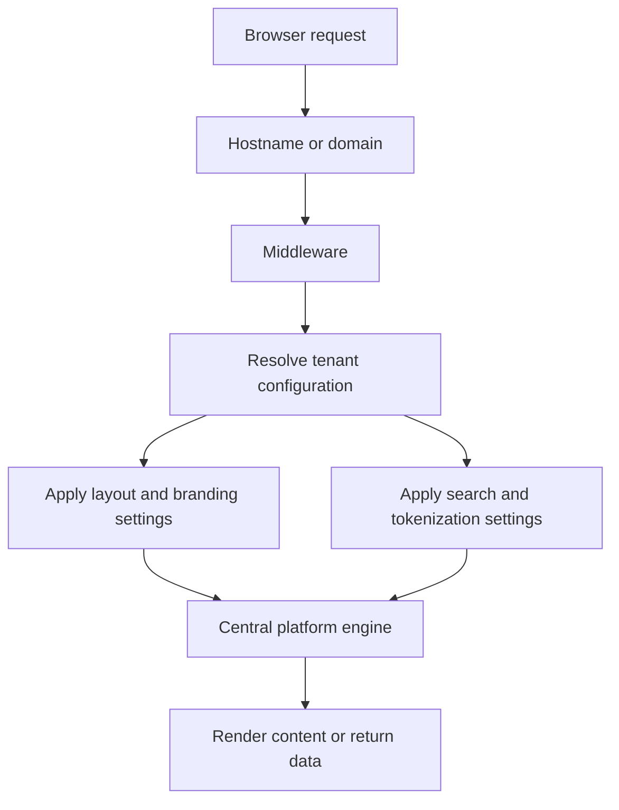
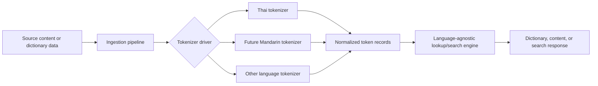
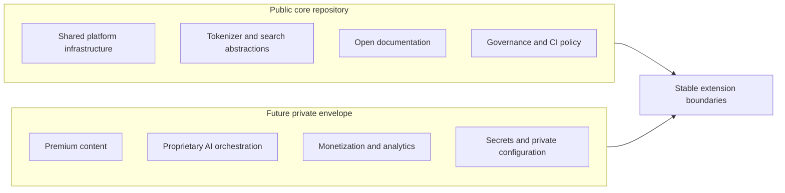

# Architecture Blueprint

`lingua-core-platform` is a governance-first modular monolith platform engine for Thai-English linguistic tooling, tokenizer/search infrastructure, SEO-first educational content, and future multilingual expansion.

This document defines the initial architecture direction before application/runtime code is added. It is intentionally high level. Detailed implementation choices, production migrations, and major architectural decisions should be captured later in `docs/adr/`.

## System Overview

The platform is intended to serve multiple language-learning and linguistic experiences from one shared core. A request enters through a tenant-aware routing layer, resolves the appropriate tenant configuration, applies tenant-specific presentation and language settings, and delegates to shared platform capabilities.

The central engine should own reusable infrastructure such as routing conventions, tokenizer interfaces, lookup/search abstractions, dictionary data access, tenant configuration boundaries, and shared validation logic.

## Core Architectural Principles

- Preserve a modular monolith as the default architecture.
- Keep tenant domains and language domains in one repository with clear internal module boundaries.
- Treat tokenization and linguistic parsing as pluggable infrastructure.
- Keep the public repository focused on shared platform infrastructure and open governance.
- Separate public/open data from premium, proprietary, or private data.
- Prefer static rendering, SEO durability, dictionary/search foundations, and browser-native fallbacks before interactive multi-user features.
- Avoid framework, hosting, database, or AI-provider lock-in in this blueprint.
- Record major architectural decisions in ADRs before making them binding.

## Directory Layout

Current and intended high-level layout:

```text
.
├── src/
│   ├── core/
│   │   └── tokenizers/
│   │       ├── index.ts
│   │       ├── thai/
│   │       └── mandarin/
│   ├── middleware.ts
│   ├── database/
│   ├── tenants/
│   └── shared/
├── docs/
│   └── adr/
├── ARCHITECTURE.md
├── DATA_SOURCES.md
└── AGENTS.md
```

Expected responsibilities:

- `src/core/tokenizers/`: tokenizer and linguistic processing interfaces, drivers, adapters, and language-specific implementations.
- `src/middleware.ts`: conceptual entry point for hostname/domain-aware tenant resolution and request context setup.
- `src/database/`: conceptual home for database access boundaries, query modules, schemas, and migration integration when selected by future ADRs.
- `src/tenants/`: tenant configuration, feature boundaries, branding settings, routing metadata, and language/search settings.
- `src/shared/`: cross-cutting utilities, shared types, validation helpers, and infrastructure that is not language- or tenant-specific.

## Multi-Tenant Routing Concept

Tenant routing should be resolved before business logic runs.

1. A hostname or domain request enters middleware.
2. Middleware resolves tenant configuration from a tenant registry or data store.
3. Layout, branding, search behavior, tokenizer preferences, and content boundaries are applied to the request context.
4. The central engine serves the request through shared infrastructure and tenant-aware configuration.



## Pluggable Tokenizer And Search Abstraction

The core lookup/search engine must not depend directly on one language implementation. Language-specific behavior should sit behind stable interfaces so Thai-first support can expand to Mandarin and other languages without rewriting core search logic.

Example driver responsibilities:

- Thai tokenizer driver: segmentation, normalization, tone-aware metadata, transliteration or romanization hooks where licensed data allows.
- Future Mandarin tokenizer driver: segmentation, normalization, pinyin hooks, simplified/traditional metadata, and language-specific ranking hints.
- Core lookup/search engine: receives normalized token output and metadata through shared interfaces, then handles indexing, lookup, filtering, and ranking in a language-agnostic way.



## Database Blueprint

This schema is conceptual and subject to ADRs and future migration decisions. It does not select a production database, migration framework, hosting provider, or ORM.

Candidate entities:

- `tenants`: tenant identity, hostname/domain mapping, locale defaults, enabled languages, branding references, and feature flags.
- `dictionary_entries`: normalized dictionary headwords, definitions, language metadata, tokenization metadata, source provenance, and licensing references.
- `dictionary_tenant_tags`: tenant-specific tagging, visibility, curation, lesson grouping, or search weighting applied to dictionary entries.
- `users`: future account identity, roles, tenant membership, and preference metadata if interactive account-based features are introduced.

The first implementation should keep data access boundaries explicit and avoid scattering persistence details across core language logic.

## Public Core And Future Private Envelope

The public repository owns shared platform infrastructure, governance files, open documentation, reusable tokenizer/search abstractions, and source code that can be safely distributed under the repository license.

Future private repositories or private deployment envelopes may own premium educational content, proprietary AI orchestration, monetization logic, analytics integrations, secrets, private prompts, and tenant-specific commercial data.



## Explicit Non-Goals

- No microservices yet.
- No frontend framework lock-in in this document.
- No production schema migrations yet.
- No AI dependency as a core runtime requirement.
- No commitment to a specific database, hosting provider, ORM, or deployment platform.
- No proprietary content, private prompts, commercial datasets, analytics secrets, or tenant-specific private data in the public core.

## Deterministic Query Explainability

The search query pipeline is intentionally shaped like a deterministic
compiler/runtime boundary:

```text
Raw Query
-> Lexer
-> Parser AST
-> Planner / Compiler
-> Execution Plan IR
-> Runtime Query Execution
-> Match Results / Diagnostics
```

Explainability infrastructure is an additive introspection layer over these
stage artifacts. It must not rewrite queries, inspect corpus state for planning,
introduce ranking, or mutate runtime execution. Equivalent inputs must produce
equivalent explanations, traces, stage artifacts, and serialized output.

Query explanations summarize structural remnants from each deterministic stage:
lexing, parsing, AST shape, compilation, execution-plan IR, runtime query shape,
execution results, and diagnostics. Explanation artifacts preserve source-span
provenance where the stage provides it and avoid retaining live runtime objects.

Execution traces are structural artifacts, not telemetry systems. They are not
performance profilers, metrics systems, tracing SDK integrations, adaptive
runtime infrastructure, or optimization signals. Trace identifiers and step
identifiers must be deterministic, timestamps must remain absent or explicitly
null, and metadata must be serialization-safe primitive data only.
